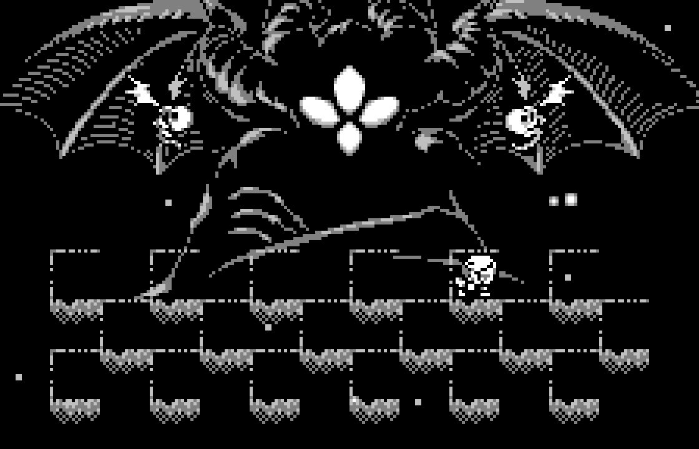
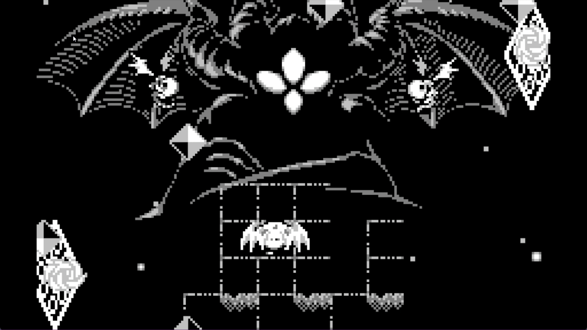
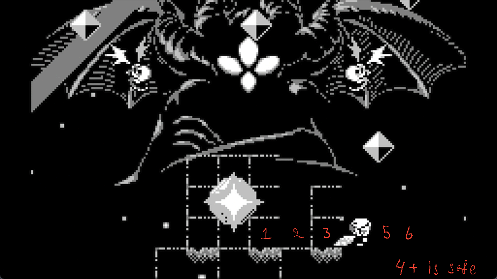
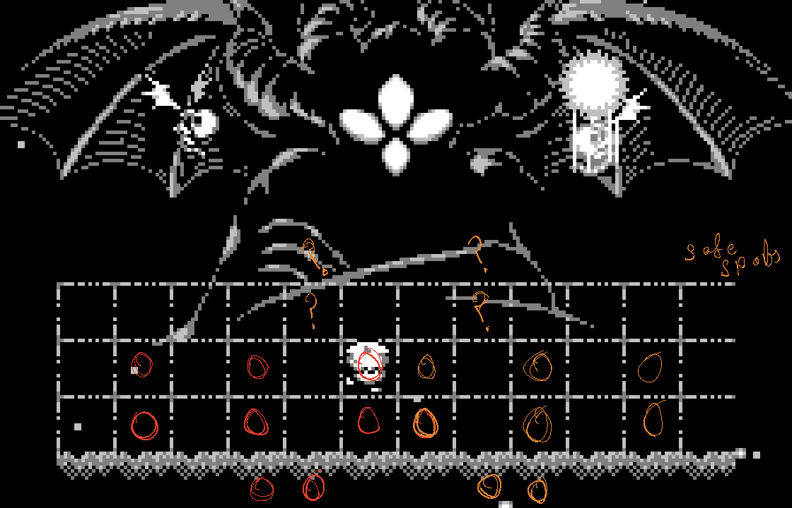
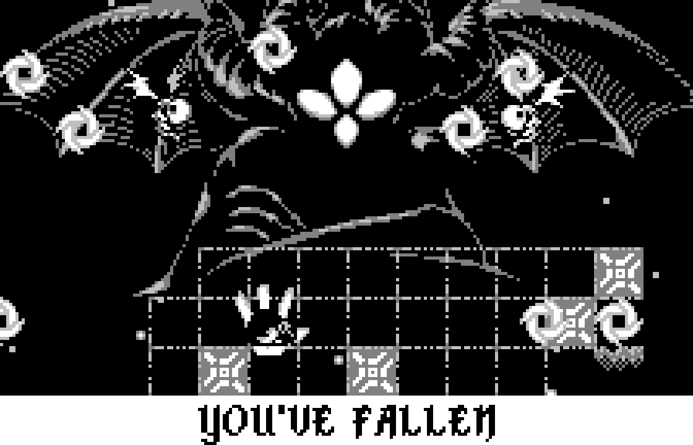

# I hope you know what you're doing here

I recommend considering the general tips and going at it yourself.  

And if you feel stuck somewhere you can look here.  

This is by no means an extensive guide for the entire fight. Though a lot of tips and some pattern information about attacks that would hopefully save you a lot of time. 
## General Tips

- Make sure your hand position is not awkward and doesn't cause pain.
- Pay attention to the spawn order of attacks, their position, and order.
- Pay attention to the position of attacks, and their behavior. All attacks are predictable, even if not always dodgeable. 
- Try to get as many tiles during the transition so you don't have to survive phase 2 for too long.
- Make sure to take breaks. I barely followed this one, but I do highly recommend it.

## Arena Management
There are majorly two different approaches to this. 

### Checkerboard Approach   
Since you have wings you can take every other block and use it. Making a checker pattern of the board which gives you a lot more room to dodge attacks. I didn't go through with this. So I can't say anything about it. Other than from my experience, I believe it's not as effective as other one. Not to say it can't get the work done. 

It is a lot safer and gives more room to move around. So you pick either. 

### 3x3 Approach 
The second is shortening the arena and start chipping at it from either sides going towards the middle. I used this one, and found it a lot more effective. I used this approach. Couldn't find a better name so I decided to stick with 3x3. 
### Paw Platform 
Funny name, I know. It kind of looks like a paw. It's a 3x3 with a hole in the middle. And than 5 tiles around it. 
The minimum amount tiles you need to dodge every phase 1 attack. 
The 5 tiles are completely optional for most attacks, but makes some attacks very easy. You can consistently dodge every phase 1 attack with just this and, well, a bit of practice of course. 

## Attacks
I came up with names for the attacks. Makes things easier for me. 
Shrimps spawn an attack, and once that attack ends Cif attacks. They alternate this way during phase 1. 

Phase 2, they simultaneously attack. In a main attack + a sub attack. 

Here's a video of how I generally do phase 1. 
### Attacks - Phase 1

These attacks are ranked from easy to hard. Kind of, but not strictly. It's just how much effort it required to dodge them.

#### 1. Diamond Trail - Cif

Move off the grid. 

Fun Fact: you can move off the grid at the top and hit her while the hexagons are going by. If you want to be efficient.

#### 2. Crescent Rings - Shrimp

Move off the grid around the middle. And just chill there. 

#### 3. Shooting Stars - Cif

Look out for the trails and avoid them. Not much to write about this. Though if you do use a 3x3 approach. Remember you have extra tiles to move around in case you can't dodge it all on a 3x3. 

#### 4. Diamond Spiral - Shrimp

Has 2 spawn locations. Top or Mid. If it's higher you can stay in the middle 3x1 or top 1x1. If it's lower you can move to either top or bottom 3x1s. I made an attempt at visualizing it real quick on my laptop. 
If it spawns at the top, the pink tiles are safe. Or explicitly said, 1st row and third row are safe. 
If it spawns at the other position, blue tiles are safe. Second and Fourth row. 
The circle in both is also a safe spot. You can hit her from those spots as well. 

#### 5. Star Burst - Cif

Don't stay in the 2x2 with stars. A very easy attack.to dodge (if you don't panic). I would recommend focusing around your character and not try to look at every star that comes into your screen. 

#### 6. Diamond Blast - Cif

Shift rows and move 4 tiles away horizontally from the blast. Pretty much all you need to do.  

There is another way to dodge it, which is you walk straight into the blast just as it's about to explode. I've done it a few times but I found it a lot difficult to execute consistently. In case you're feeling daring. 

Positions 4-6 are safe. 

#### 7. Sword Shower - Shrimp

Look for the one that spawns the last and go under it. And move out once it starts falling. Then just move around. Key point to note: you don't have to keep moving to dodge the palms, they take like around a second to pop, so just move slowly focusing on the zapping beam trails.

The main thing to note is the palms won't immediately pop on you. They take around a second to pop, so you can casually move around and watch for the laser beams. 

The beams start going off based on the order in which the swords hit spawm/hit the ground.

#### 8. Spinning blades - Shrimp

They start moving based on the spawn pattern of their walls. Lure 1 and 2 to one direction and then 3 and 4 to the other one. 1 and 2 move almost together, 3 takes a little while and 4 follows with a delay too.

#### 9. Spinning Swords - Shrimp

There's four of them. And after descending they target the row the player is on. I recommend going to the bottom row, and as every sword moves horizontally move up. Or you can do it the other way around as well. Remember you can float towards the top as well. 

#### 10. Burst Shooting - Cif

Has 2 variants. Just horizontally and you should dodge them easily. 

#### 11. Palm Blades - Cif
Watch for the blinking palm and then take a U turn. Watch out for the blades and repeat.

#### 12. Switch Blades - Shrimp

You can dodge this easily by staying on the third row. As soon as you see an opening go all the way across. It's a bit more tricky on a smaller platform, but you get the hang of it after a little practice.  

Fun fact, the outer rings have a slight gap between them, you can squish through it if you're feeling daring.

#### 13. Ping Pong - Shrimp

Balls move according to the spawn pattern of the walls. Last one will target your position. This used to be the hardest of all attacks until I figured out placing two tiles at the bottom. Look for the last spawner and hover over to that edge. Look at the spawner, and as soon the balls hit it move the other direction. This is especially important if the last one is on either bottom left or right (second video). You have very little time to dodge it. The 4th row is your best friend for this one. 
This used to be the hardest attack for me. And it became the simplest one once I figured out how it works. I would place it at 1st on the list for how simple it gets. But I digress. 

Pay attention to the spawners. and especially the last one. If it's on the right side move to the tile marked R. If it's on the left side then L. As soon as you see the ping pong touch the last spawner, move to R. 

#### 14. Machine Gun - Cif

Couldn't come up with a better name. Move towards the open area, as far as you can until the balls are shot. And then immediately start moving towards the other direction. This is probably the most skill oriented attack in phase 1. But you get the hang of it pretty quickly. I recommend practicing it on a 4x1 and then moving to a 3x1. 

#### 15. Ball Shower - Cif

Happens after 4 shrimp attacks. Or technically 8 Attack cycle (4 shrimp + 4 Cif). Generally your goal should be to be able to hit her 16 times before this happens. If you do find yourself here, I'd recommend waiting another attack wave before going into phase 2. This attack makes phase 2 attacks even more annonying. 

### Phase 2 - Incomplete

I have yet to organize these. Attacks are similar to phase 1 but faster, and with support. 
Pray to *** you get a star burst, or spinning blade attack you'll be able to easily skip phase 2. 

Phase 2 can go very differently. But the goal here is to hit all the tiles onto her as soon as you can. If you weren't able to get all 12 tiles from phase 1, you can gather and hit those here as well. 

Here's a not so lucky phase 2. 

Here's an ideal phase 2. 

#### 1. Star Burst++
The best attack in phase 2. Gives you enough time to hit all 12 tiles. While being easy to dodge. 

#### 2. Spinning Blades++
Try to stay around the middle until they start moving. One and Two start moving around the same time, the trick is to lure those to one side, and then go around them as Three and Four come after you. 

#### 3. Shooting Stars++
Pretty straight forward as well. If I have to say anything then try to go away from the shooting star, as you don't want to hit a lazer beam trying to dodge the blast. 

#### 4. Sword shower++
This is same as phase 1 except faster. Try to look for the first spawn, and as soon as it hits the ground go in it's position. Then you can easily hit her 12 times. 

This attack has another part to it, but you can entirely skip it if you hit all your shots while the swords are falling. I'd put a clip here but I couldn't find one in my files... 

#### 5. Hexagon Trails++

Try to go in the direction of the diamonds, and switch lanes and go the other direction, and repeat. 
Remember you can use the fourth row as well. And also you can glide on the row above the first one.

#### 6. Diamond Blast++

As long as you switch rows from the one where the blast happens, you'll be safe from it. There are safe spots from the shrimp attacks I highlighted below.

You want to switch rows from the blast and go to one of these spots. 

!! The question spots I've not tested yet... But I believe they're safe. 

#### 7. Bust Shooting++
Try to stay around the corners. Either left or right.  

Remember you can glide over the edge as well. 

#### 8. Bust Shooting 2++

Try to go to the other direction from where the diamonds fall.  

#### 9. Palm Blades++
I encountered this one very rarely. Couldn't really figure a way to do it so my main strategy for this one was just to give up if I see it.  
I plan on revisiting and figure out a way to get through it. Sometime soon.  

#### 9. Doom 
I've only ever reached this once and that was trying to do it without burdens and normal rod. Supposedly happens when you stay on phase 2 for too long. 

### Phase 3 - Endurance
I have yet to organize these as well.  You'll need to practice these a few times. Once you can start consistently reaching phase 3, it's only about time you finish it. 
#### The Square
Continuous jump rope you have to do until the end. As the line approaches you, move towards it. 
#### Wave 1 - Rockets

They drop on a 3x3 area. I found it a bit annoying to concentrate on the square and also the rocket targets. You can move position after you make your third jump. And repeat that three times, and you're onto the next wave.  

Count your jumps and move to the other side after your third jump. Notice how moving after 3 jumps also dodges rockets simultaneously.  

#### Wave 2
There's 8 rounds of diamonds. And there's also 8 jump ropes. 

#### Wave 3 
26 Rounds of diamonds. 10 jump ropes. 

#### Wave 4
24 Total jump ropes. Including the 2 in black screen. You can see I lost to the black screen on this one. Truly an enjoyable experience. 

#### Black Screen
There's 2 jumps you have to make once the screen goes black. You can see the first one before the screen goes black.  Time it and Move forward. Wait but a second, move forward again. 

That's it. This part is arguably the most trivial part of the entire battle. Yet I failed here so many times...

Here's an image of it so you can familiarize yourself with it ;) 

## That's all from me
This is very incomplete for a guide. I plan on finishing it eventually. Eventually....
Anyhow, hope this was useful. Let me know if you have any suggestions.