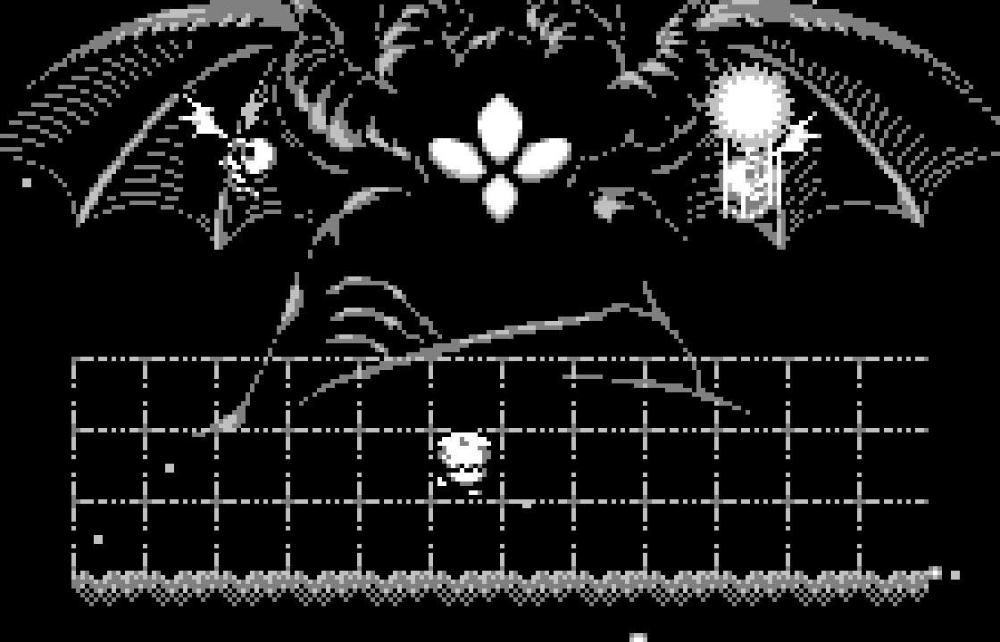
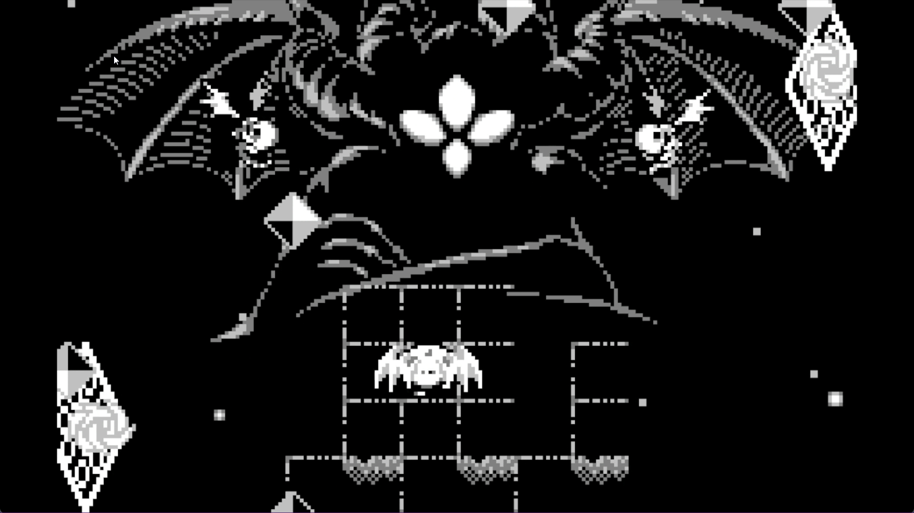
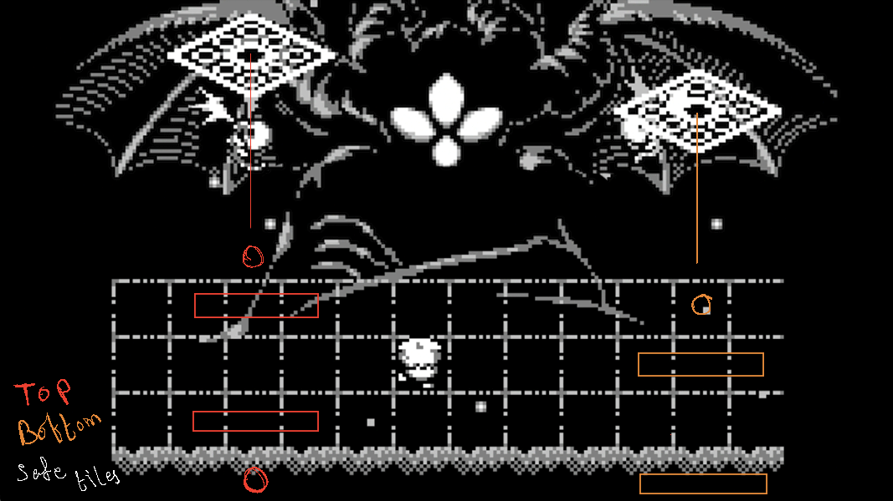
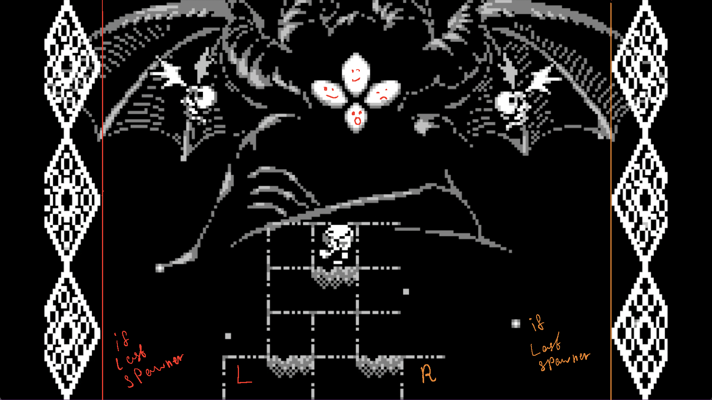

# I hope you know what you're doing here

Very scuffed notes/tips on the cif fight.

I recommend considering the general tips and going at it yourself.

And if you feel stuck somewhere you can look here.

This is by no means an extensive guide for the entire fight.
Though a lot of tips and some pattern information about attacks would hopefully save you a lot of time.

## General Tips

- Make sure your hand position is not awkward and doesn't cause pain.
- Pay attention to the spawn order of attacks, their position, and order.
- Pay attention to the position of attacks, and their behavior. All attacks are predictable, even if not always dodgeable.
- Try to get as many tiles during the transition so you don't have to survive phase 2 for too long.
- Make sure to take breaks. I barely followed this one, but I do highly recommend it.

## Arena Management

There are majorly two different approaches to this. Both have their pros and cons, kind of.

### Checkerboard Approach

Since you have wings you can take every other block and use it.

It is a lot safer and gives more room to move around.

### 3x3 Approach

The second is shortening the arena and start chipping at it from either sides going towards the middle. I used this one. A slightly modified version below.

### Paw Platform

Funny name, I know. It kind of looks like a paw. The minimum structure you'd need to dodge every phase 1 attack.

It's a 3x3 with a hole in the middle. And than 5 tiles around it. 5 tiles being optional for all but 2 attacks.

You can consistently dodge every phase 1 attack with just this and, well, a bit of practice of course.

## Attacks

I came up with names for the attacks. But you can call them whatever you want.

Shrimps spawn an attack, and once that attack ends, Cif attacks. They alternate this way during phase 1.

In Phase 2, they both attack simultaneously.

In phase 3, the shrimps go away.

Here's a video of how I generally clear blocks on the arena during phase 1.

https://github.com/Nevieltez/N_Void-Stranger/assets/96298249/2eb4a6d0-892d-4c4a-8659-7924a02e94e5

### Attacks - Phase 1

These attacks are ranked from easy to hard. Kind of, but not strictly. It's based on how difficult I found them.

#### 1. Diamond Trail - Cif

Move off the grid, and wait for it to end.

You can also move off the grid at the top and hit her while the hexagons are going by. If you want to be efficient.

https://github.com/Nevieltez/N_Void-Stranger/assets/96298249/56ea5b7d-0aec-4051-b745-ab8327b2bc90

#### 2. Crescent Rings - Shrimp

Move off the grid around the middle. And just chill there.

https://github.com/Nevieltez/N_Void-Stranger/assets/96298249/129e982c-1081-47e7-b942-7e2b386b26ee

#### 3. Shooting Stars - Cif

Look out for the trails and avoid them. Not much to write about this. Though if you do use a 3x3 approach. Remember you have extra tiles you can place to move around in case you can't dodge it all on a 3x3.

https://github.com/Nevieltez/N_Void-Stranger/assets/96298249/292b1225-8e86-4435-b603-4b1bad12fefe

#### 4. Diamond Spiral - Shrimp

Has 2 spawn locations. Top or Mid.

If it's higher you can stay in the middle 3x1 or top 1x1.
If it's lower you can move to either top or bottom 3x1s.

I made an attempt at visualizing it real quick on my laptop.
If it spawns at the top, the pink tiles are safe. Or explicitly said, 1st row and third row are safe.
If it spawns at the other position, blue tiles are safe. Second and Fourth row.
The circle in both is also a safe spot. You can hit her from those spots as well.

https://github.com/Nevieltez/N_Void-Stranger/assets/96298249/64ef497b-5710-4038-849f-965a5ca69704

#### 5. Star Burst - Cif

Don't stay in the 2x2 with stars. A very easy attack to dodge, if you don't panic.
I would recommend focusing around your character and not try to look at every star that comes into your screen.

https://github.com/Nevieltez/N_Void-Stranger/assets/96298249/2ab20afe-33ca-4a0d-b85d-b820943448da

#### 6. Diamond Blast - Cif

Shift rows and move 4 tiles away horizontally from the blast.

In case you're feeling a bit daring, there is another way to dodge it, which is you walk straight into the blast just as it's about to explode.I've done it a few times but I found it a lot difficult to execute consistently.

Here's a little scribbles visualizing the safe positions. 4-6 are safe.

https://github.com/Nevieltez/N_Void-Stranger/assets/96298249/9050eb79-4db0-4166-958a-7426ad359e24

#### 7. Sword Shower - Shrimp

Look for the one that spawns the last and go under it. Once it starts to fall, move out of the way.
Just move around slowly watching out for the lasers.

The main thing to note is the palms won't immediately pop on you. They take around a second to pop, so you can slowly move around watching out for the laser beams.

The beams start going off based on the order in which the swords hit spawm/hit the ground.

https://github.com/Nevieltez/N_Void-Stranger/assets/96298249/457a7575-0fc6-45c3-b4e2-a85d7ceca529

#### 8. Spinning blades - Shrimp

They start moving based on their spawn order.
Lure 1 and 2 to either left or right, once they're in motion go under them and lure the other 2 to the opposite direction.

1 and 2 move almost at the same time, 3 takes a little while and 4 follows with a delay.

https://github.com/Nevieltez/N_Void-Stranger/assets/96298249/32794556-a5b1-4e0a-89dd-1b5f3888eddf

#### 9. Spinning Swords - Shrimp

After descending they target the row the player is on. I recommend going to either bottom or top row, and move the other direction as each sword starts to move in your direction.

Remember you can float towards the top as well.

https://github.com/Nevieltez/N_Void-Stranger/assets/96298249/bc9b1bff-8cb3-454d-9a85-1ca6387d63bb

#### 10. Burst Shooting - Cif

Has 2 variants. I recommend moving horizontally to dodge them.

https://github.com/Nevieltez/N_Void-Stranger/assets/96298249/886e864b-d1de-4a50-ab26-dc5f48374802

https://github.com/Nevieltez/N_Void-Stranger/assets/96298249/5d77488a-852b-425d-861d-639d0a86405d

#### 11. Palm Blades - Cif

Move slowly and watch for the blinking palm and then take a U turn. Watch out for the blades and repeat.

https://github.com/Nevieltez/N_Void-Stranger/assets/96298249/3c5e173a-364a-4045-b600-2e389ac54ead

#### 12. Switch Blades - Shrimp

You can dodge this easily by staying on the third row. As soon as you see an opening go all the way across.

It's a bit more tricky on a smaller platform, you have to move into it, and then wait for another opening to move out.

If you're feeling a bit daring, the outer rings have a slight gap between them, you can squish through them.

https://github.com/Nevieltez/N_Void-Stranger/assets/96298249/e06c9b51-c1dc-4b91-8f1b-f8f1ab65c943

#### 13. Ping Pong - Shrimp

Balls move according to the spawn order. After the last bounce it will target the player.

Spawners order matters, especially the last one.
If it's on the right side, move to the tile marked R.
If it's on the left side then L.
As soon as you see the ping pong touch the last spawner, move to the opposite side.

https://github.com/Nevieltez/N_Void-Stranger/assets/96298249/e03338d1-2f46-4aa4-8595-ea7917e301e5

#### 14. Machine Gun - Cif

Couldn't come up with a better name. Move towards the open area, as far as you can until the balls are shot. Once balls are shot immediately start moving towards the other direction.

This is probably the most skill oriented attack in phase 1. But you get the hang of it pretty quickly.

I recommend practicing it on a 4x1 and then moving to a 3x1. On the bottom row, of course.

https://github.com/Nevieltez/N_Void-Stranger/assets/96298249/a7ab5209-63e0-43d4-b024-3636dcbd8bb1

#### 15. Ball Shower - Cif

Happens after 4 shrimp attacks. Or technically 8 Attack cycle (4 shrimp + 4 Cif).
Generally your goal should be to be able to hit her 16 times before this happens.
If you do find yourself here, I'd recommend waiting another attack wave before going into phase 2. This attack can make some phase 2 attacks even more annonying.

https://github.com/Nevieltez/N_Void-Stranger/assets/96298249/079ef05e-4d99-4d98-855f-761d3869c69a

### Phase 2 - Incomplete

I have yet to organize these. Attacks are similar to phase 1 but faster, and with support.

Phase 2 can go very differently. But the goal here is to hit all the tiles onto her as soon as you can. If you weren't able to get all 12 tiles from phase 1, you can gather remaining ones here.

Generally if you gather enough tiles before the transition, you could hit her 12 times during one attack cycle, effectively skipping phase 2.

Here's a not so lucky phase 2.

https://github.com/Nevieltez/N_Void-Stranger/assets/96298249/b54a5342-f70a-4225-a7ae-4e53534fb336

Here's an ideal phase 2.

https://github.com/Nevieltez/N_Void-Stranger/assets/96298249/77a68fa1-1ccb-4cee-ba1e-705e2a4625a5

#### 1. Star Burst++

The safest attack in phase 2. Gives you enough time to hit all 12 tiles. While being easy to dodge.

https://github.com/Nevieltez/N_Void-Stranger/assets/96298249/eaea8477-2881-4252-bd31-466d0ddee295

#### 2. Spinning Blades++

Try to stay around the middle until they start moving. One and Two start moving around the same time, the trick is to lure those to one side, and then go around them as Three and Four come after you.

https://github.com/Nevieltez/N_Void-Stranger/assets/96298249/6193007a-05b1-4a48-8fef-f29a46b1bdfb

#### 3. Shooting Stars++

Pretty straight forward. Don't think I have anything to say about it.

https://github.com/Nevieltez/N_Void-Stranger/assets/96298249/5a59d296-2a8f-4961-8c51-e3bc3f419864

#### 4. Sword shower++

This is the same as phase 1 except it's faster. And has a second part to it. Try to look for the first spawn, and as soon as it hits the ground go in it's position. From there you can quickly start hitting her.

This attack has another part to it, but you can entirely skip it if you hit all your shots while the swords are falling. I'd put a clip here but I couldn't find one in my files...

https://github.com/Nevieltez/N_Void-Stranger/assets/96298249/98ea1d10-d766-468f-89a8-366e8a44f2a9

#### 5. Hexagon Trails++

Not much to say for this one as well.
Try to go in the direction of the diamonds, and switch lanes and go the other direction, and repeat.
Remember you can use the fourth row as well. And also you can glide on the row above the first one.

https://github.com/Nevieltez/N_Void-Stranger/assets/96298249/ffb61665-4a48-4455-be62-a5c59e0b3059

#### 6. Diamond Blast++

As long as you switch your row/column from where the blast happens, you'll be safe from it. For the srimp attacks, there are constant safe spots from the shrimp attacks I highlighted below.

You want to switch rows from the blast and go to one of these spots. These are constant safe spots from the shrimp attacks.

!! The question spots I've not tested yet... But from some old recordings I believe I think they're safe.

https://github.com/Nevieltez/N_Void-Stranger/assets/96298249/ef075b52-d134-4bb7-8bfb-3eb5712e7de9

#### 7. Bust Shooting++

Try to stay around the corners so you can dodge the bigger diamonds easily. Either left or right.

Remember you can glide over the edge as well.

https://github.com/Nevieltez/N_Void-Stranger/assets/96298249/07dd37eb-3ca2-4d41-98fd-575ff5ad030a

#### 8. Bust Shooting 2++

Try to go to the other direction from where the diamonds fall.

https://github.com/Nevieltez/N_Void-Stranger/assets/96298249/b9391b33-9fa2-46b7-ab51-b7f402f90dea

#### 9. Palm Blades++

I encountered this one very rarely. And when I did I couldn't figure it out correctly. Sadly I do not have any record of this one :(

#### 9. Doom

I've only ever reached this once and that was trying to do it without burdens and normal rod. Supposedly happens when you stay on phase 2 for too long.

### Phase 3 - Jump Rope

Continuous jump rope you have to do until the end. As the line approaches you, move towards it.

I have yet to organize these as well. You'll need to practice these a few times.

Once you can start consistently reaching phase 3, it's only about time you finish it.

After a little practice you should be able to subconciousllly jump over the lines.

#### Wave 1 - Rockets

They drop on a 3x3 area. You can move out of the way after you make your third jump. And repeat that three times, and you're onto the next wave.

I found it a bit annoying to concentrate on the square and also the rocket targets.

Count your jumps and move to the other side after the third jump. Notice how moving after 3 jumps also dodges rockets simultaneously.

https://github.com/Nevieltez/N_Void-Stranger/assets/96298249/4eaa2e1c-07a4-4c5a-9367-a058f816c1ab

#### Wave 2

There's 8 rounds of diamonds. And there's also 8 jump ropes.

Only advise I have currently is to try to stay around the middle.

https://github.com/Nevieltez/N_Void-Stranger/assets/96298249/f33a4ceb-7efb-4ee3-8504-66f88fa540d1

#### Wave 3

26 Rounds of diamonds. 10 jump ropes.

Try to move towards the openings. There's also a little gap between the diamonds you can go through if you aren't directly at the opening.

#### Wave 4

24 Total jump ropes. Including the 2 in black screen. You can see I lost to the black screen on this one. Truly an enjoyable experience.

This is the final stretch. It goes from fast to real slow. 1 second slow to be preciese.

https://github.com/Nevieltez/N_Void-Stranger/assets/96298249/3ed202ad-3320-4266-b340-63c9b45a0c72

##### Black Screen

There's 2 jumps you have to make once the screen goes black. You can see the first one before the screen goes black. Time it and Move forward. Wait one second, move forward again.

That's it. This part is arguably the most trivial part of the entire battle. Yet I've failed here so many times...

Here's an image of it so you can familiarize yourself with it ;)

## That's all from me

This is still very incomplete. I plan on finishing it eventually. Eventually....
Anyhow, hope this was useful. Let me know if you have any suggestions.
